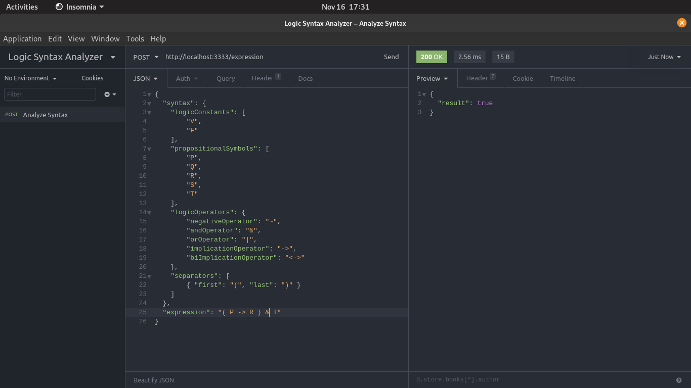

# 🔍 L.S. Analyzer


## 📝 Description
L.S. Analyzer is a REST API that receive a syntax and an expression that you defines and return if the expression is valid, based on your syntax.

## 💻 Technologies
- TypeScript
- NodeJS
- Jest (TDD)
- Express (Server)

## 🚀 Run on your machine
Note: it requires yarn installed 

> Initial steps
```bash
$ git clone https://github.com/ruifernandees/logic-syntax-analyzer.git
$ cd logic-syntax-analyzer
```

> Run the server
```bash

# Install all dependencies
$ yarn install

# Run the automated tests
$ yarn test

# Start the server
$ yarn start
```

### 📄 Request Format
#### Note: you can customize the properties' values
```json
{
	"syntax": {
		"logicConstants": [
				"V",
				"F"
		],
		"propositionalSymbols": [
				"P",
				"Q",
				"R",
				"S",
				"T"
		],
		"logicOperators": {
				"negativeOperator": "~",
				"andOperator": "&",
				"orOperator": "|",
				"implicationOperator": "->",
				"biImplicationOperator": "<->"
		},
		"separators": [
				{ "first": "(", "last": ")" }
		]
	},
	"expression": "( P -> R ) & T"
}
```